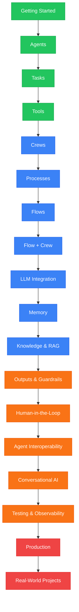

# CrewAI Masterclass

> Venkata Bhattaram (c) 2026

An extensive, beginner-to-expert **CrewAI Masterclass** with hands-on code examples — from installing CrewAI and building your first AI agent, through tasks, tools, crews, processes, memory, knowledge and RAG, event-driven Flows, multi-agent orchestration, human-in-the-loop workflows, testing, observability, and production deployment.

## Learning Path

**Green = Beginner** &nbsp; | &nbsp; **Blue = Intermediate** &nbsp; | &nbsp; **Orange = Advanced** &nbsp; | &nbsp; **Red = Expert**

The Masterclass progressively moves from individual CrewAI building blocks to complete production-ready AI systems:

**Agent → Task → Tool → Crew → Process → Flow → Flow + Crew → Memory → Knowledge/RAG → Guardrails → Human-in-the-Loop → Testing → Production**
## CONTENTS
### [Introduction](./01-foundations/md/introduction.md)
#### [Installation](./01-foundations/md/installation.md)